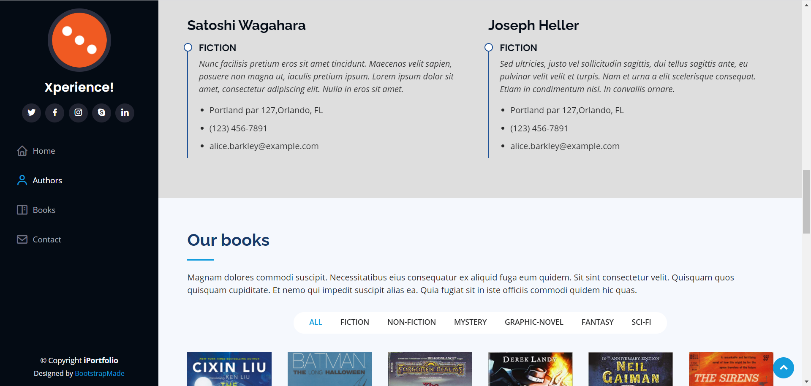
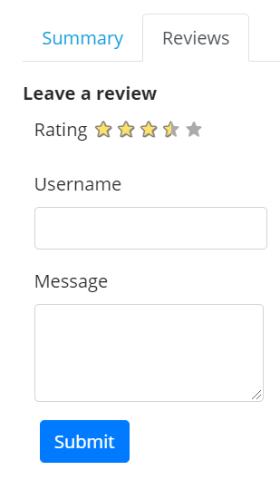

 

# Xperience Statiq Sample Application

Sample .NET Core console application using [Statiq](https://statiq.dev/) to generate a single-page application which is deployed to GitHub Pages: https://kentico-ericd.github.io/



## :gear: How does it work?

The website is built by a GitHub Action defined by [build.yml](/.github/workflows/build.yml) using `dotnet run`. When the Console application runs, it establishes a connection to the Xperience CMS website by loading the connection string from an environment variable:

```cs
CMSApplication.PreInit(true);
var connString = Environment.GetEnvironmentVariable("CMSConnectionString");
ConnectionHelper.ConnectionString = connString;
CMSApplication.Init();
```

The application's behavior is defined in `Program.cs`:

```cs
return await Bootstrapper
    .Factory
    .CreateDefault(args)
    .AddPipeline<RatingPipeline>()
    .AddPipeline<BookPipeline>()
    .AddPipeline<AuthorPipeline>()
    .AddPipeline<ContactPipeline>()
    .AddPipeline("Assets", outputModules: new IModule[] { new CopyFiles("assets/**") })
    .RunAsync();
```

Here you can define many settings and customizations, but you will mostly define the __Pipelines__ your project requires.

### Pipelines

[Pipelines](https://statiq.dev/framework/pipelines/) are the backbone of Statiq applications. A pipeline contains multiple "phases" in which each phase contains one or more __Modules__, which can retrieve data, write to the filesystem, and much more.

In the `/Xperience` directory you'll find some classes we've created to help integrate Xperience and Statiq. [`XperienceContentPipeline`](/Xperience/XperienceContentPipeline.cs) and [`XperienceObjectPipeline`](/Xperience/XperienceObjectPipeline.cs) provide an easy way to retrieve `TreeNode` and `BaseInfo` objects from the database, respectively.

In their simplest form, you only need to provide a `Query` to retrieve data, as in the [`AuthorPipeline`](/Pipelines/AuthorPipeline.cs):

```cs
class AuthorPipeline : XperienceContentPipeline<Author>
{
    public AuthorPipeline()
    {
        Query = AuthorProvider.GetAuthors();
    }
}
```

While pipelines can be used for complex functionality, they can be as simple as the above. This pipeline doesn't generate any static HTML, but its output can be accessed by other pipelines using:

```cs
context.Outputs.FromPipeline(nameof(AuthorPipeline))
```

You can also provide properties like `ReadPath` and `DestinationPath` to provide a template for generated HTML output at the specified destination, as displayed by [`BookPipeline`](/Pipelines/BookPipeline.cs).

```cs
public BookPipeline()
{
    Query = BookProvider.GetBooks();

    // Don't run this pipeline until ratings are loaded
    Dependencies.Add(nameof(RatingPipeline));
    
    // All book HTML pages are rendered using this Razor partial
    ReadPath = "content/book.cshtml";

    // Generate HTML pages with names based on book name
    DestinationPath = Config.FromDocument((doc, ctx) =>
    {
        var book = XperienceDocumentConverter.ToTreeNode<Book>(doc);
        return new NormalizedPath(StatiqHelper.GetBookUrl(book));
    });

    // Set a custom ViewModel to provide to the Razor template
    WithModel = Config.FromDocument((doc, context) => {
        var book = XperienceDocumentConverter.ToTreeNode<Book>(doc);
        var allRatings = context.Outputs.FromPipeline(nameof(RatingPipeline)).ParallelSelectAsync(doc =>
            Task.Run(() => XperienceDocumentConverter.ToCustomTableItem<RatingsItem>(doc, RatingsItem.CLASS_NAME)));
        return new BookWithReviews(book, allRatings.Result);
    });
}
```

### Modules

[Modules](https://statiq.dev/framework/pipelines/modules/) are simply some code that runs during a pipeline phase. In the `/Xperience` directory you can see that we have created 3 custom modules:

 - [XperienceContentModule](/Xperience/XperienceContentModule.cs): executes a `DocumentQuery` against the database
 - [XperienceObjectModule](/Xperience/XperienceObjectModule.cs): executes an `ObjectQuery` against the database
 - [XperienceAttachmentDownloader](/Xperience/XperienceAttachmentDownloader.cs): downloads all page attachments

Pipelines don't do anything unless they contain modules, so we've added these modules to our custom pipelines such as `XperienceContentPipeline`:

```cs
// First pipeline phase
public ModuleList InputModules
{
    get
    {
        var list = new ModuleList {
            // Load pages from content tree
            new XperienceContentModule<TPageType>(Query)
        };
        if (DestinationPath != null)
        {
            list.Add(new SetDestination(DestinationPath));
        }

        return list;
    }
}

// Second pipeline phase
public ModuleList ProcessModules
{
    get
    {
        return new ModuleList {
            // For each page, download attachments
            new XperienceAttachmentDownloader()
        };
    }
}
```

## :sunglasses: Try it yourself

1. In your Xperience CMS site, import the [statiq.zip](statiq.zip) package as a new website
1. Create a [GitHub User Pages](https://docs.github.com/en/pages/getting-started-with-github-pages/about-github-pages#types-of-github-pages-sites)
1. Fork this repo
1. Set these GitHub Secrets in __Settings__:
    - CMSConnectionString: the connection to your Xperience database
    - personal_token: your [Personal Access Token](https://docs.github.com/en/github/authenticating-to-github/creating-a-personal-access-token) with `repo` and `workflow` permissions
1. Modify `build.yml`:
    - external_repository: the name of your GitHub User Pages
    - publish_branch: desired branch to publish to

On a successful push (e.g. on step 4), the GitHub Action will run the Console application, get data from your Xperience database, generate the static HTML, and deploy it to your User Pages.

## :recycle: Automatically rebuilding the site

The static website is only rebuilt when there is a push to GitHub, so what happens when an editor adds a new page to the content tree? We want that new page to appear on the site, but we can't expect developers to manually run the GitHub action every time pages are created or updated!

To resolve this problem, we can create a [custom workflow action](https://docs.xperience.io/configuring-xperience/configuring-the-environment-for-content-editors/configuring-workflows/designing-advanced-workflows/creating-custom-action-workflow-steps). Using workflow scopes, we can then apply a workflow to every page in the content tree that contains our custom step.

```cs
public class TriggerGitHubAction : DocumentWorkflowAction
{
	private const string PERSONAL_TOKEN = "<your personal token>";
	private const string REPOSITORY = "<your GitHub user>/<statiq repostiory>";
	private const string WORKFLOW = "build.yml";

	public override void Execute()
	{
		var url = $"https://api.github.com/repos/{REPOSITORY}/actions/workflows/{WORKFLOW}/dispatches";
		var client = new HttpClient();
		client.DefaultRequestHeaders.Add("User-Agent", "Kentico-Xperience");
		client.DefaultRequestHeaders.Add("Authorization", $"Bearer {PERSONAL_TOKEN}");
		client.DefaultRequestHeaders.Add("Accept", "application/vnd.github.v3+json");
		var body = new Dictionary<string,string>() {
			{ "ref", "master" }
		};

		var response = client.PostAsJsonAsync(url, body).Result;
		if (response.StatusCode != HttpStatusCode.OK)
		{
			var logService = Service.Resolve<IEventLogService>();
			logService.LogWarning(nameof(TriggerGitHubAction), "EXECUTE", response.Content.ReadAsStringAsync().Result);
		}
	}
}
```

## :memo: Handling user interaction

> __Warning__ This is only a proof-of-concept! Do not store your credentials in javascript files, even if they are Base64 encoded. If you use this approach, you will need to find a way to secure the REST endpoint and prevent spam

You can find an example form in the _Reviews_ section of each book:



The form submit action is handled in [main.js](https://github.com/kentico-ericd/xperience-statiq-sample/blob/master/input/assets/js/main.js#L38). The form data is gathered and posted to the Xperience REST endpoint. The request must be authenticated using Basic authentication, with the Base64 encoded username and password of an Xperience user (the values have been removed from this repository):

```js
headers: {
    "Authorization": "Basic <username:password>",
    "Content-Type": "application/json",
},
```